## Deep Berlin AI For Good Hackathon 2020
[](https://deep-berlin.ai/hackathon2020/)


# Train Your Model with AWS

## Preparation
Ideally, you set up your AWS account 3-4 days before the hackathon and increase SageMaker Instance Limits as described below. This is specifically important if you want to leverage a larger number of GPU-based cloud instances to run your training jobs. 

### Step 1:  Create and Activate Your AWS Account
* https://aws.amazon.com/premiumsupport/knowledge-center/create-and-activate-aws-account/ 

### Step 2:  Create an S3 Bucket
* How to [Create an S3 Bucket](https://docs.aws.amazon.com/AmazonS3/latest/user-guide/create-bucket.html)

### Step 3:  Choose a Region
* Review the [Regions](https://docs.aws.amazon.com/general/latest/gr/rande.html#sagemaker_region) supported by Amazon SageMaker.

### Step 4:  Manage/Increase SageMaker Instance Limits (see detailed instructions [here](quota-increase.md))
[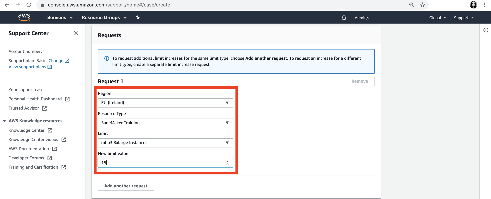](quota-increase.md)
* Review the [Default Limits](https://docs.aws.amazon.com/general/latest/gr/sagemaker.html#limits_sagemaker) for Amazon SageMaker Service Limits
* Request a [Limit Increase](quota-increase.md) if needed via the [AWS Support Center](https://console.aws.amazon.com/support/home#/)
* Review the [SageMaker Instance Pricing](https://aws.amazon.com/sagemaker/pricing/instance-types/) for an overview of supported instance types

## Let's get started!

### Step 5:  Apply Your AWS Credits (If Applicable)
* https://aws.amazon.com/awscredits/  

### Step 6:  Create a SageMaker Notebook Instance
* Navigate to Amazon SageMaker (https://console.aws.amazon.com/sagemaker/) (make sure you're in the region of your choice shown in the top right menu of your screen)

* Navigate to `Noteboook Instances` in the left side menu
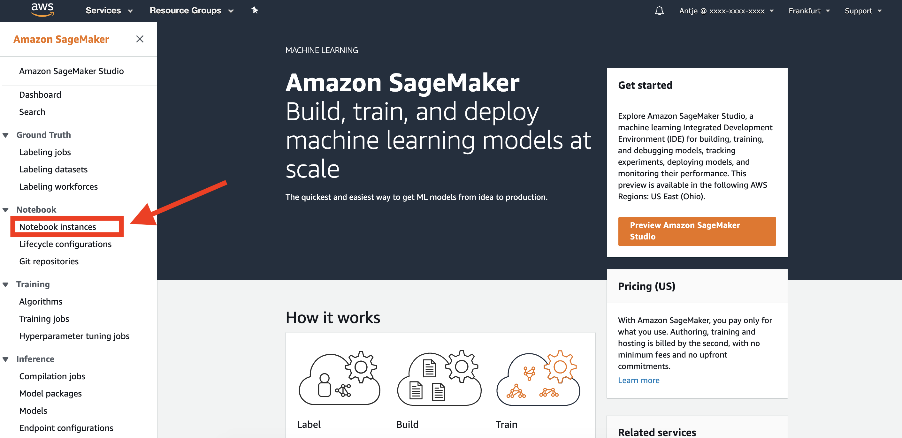

* Click on `Create notebook instance`
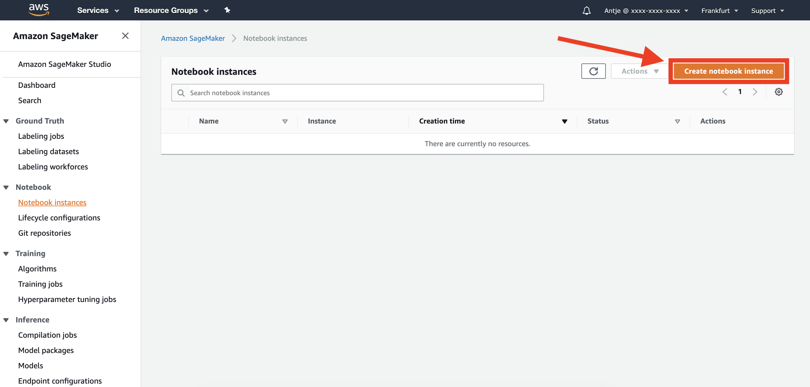

    * Choose a name for your notebook instance 
    * Select an [Instance Type](https://aws.amazon.com/sagemaker/pricing/instance-types/)
    * You might want to increase the volume size of the locally attached disk (i.e. to 250GB or 500GB)

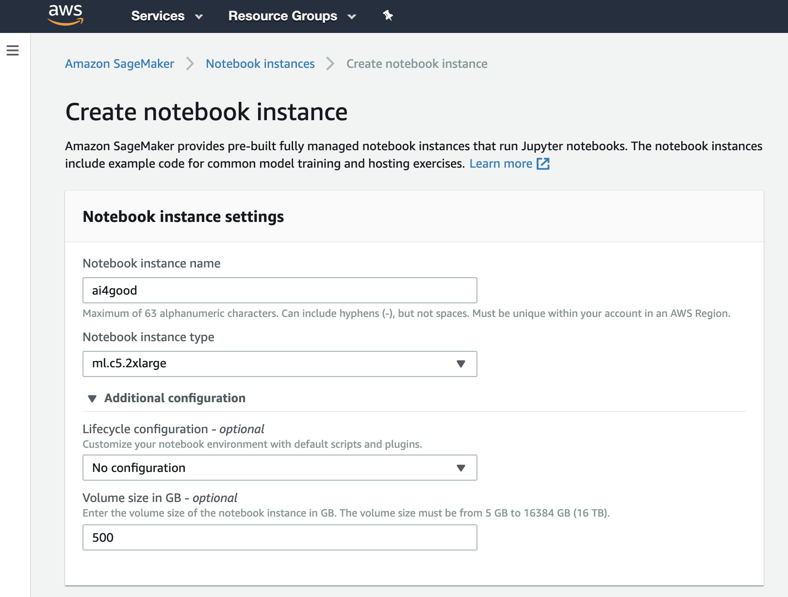

    * Select “Create a New IAM Role”
    * Select `Specific S3 Bucket` and type in the name of the S3 bucket you created earlier
    * Click `Create role`

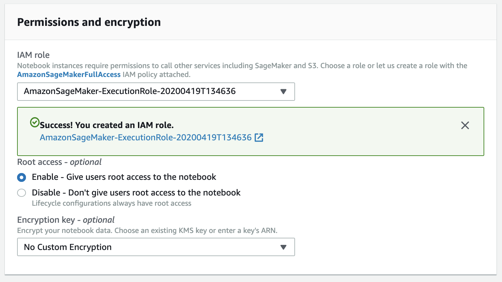

    * In `Git repositories` you can choose to clone a public Git repo to this notebook instance
    * Just provide the public Git repo URL

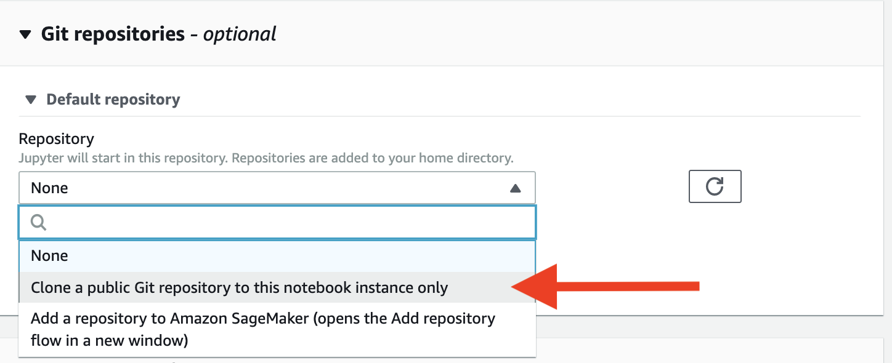

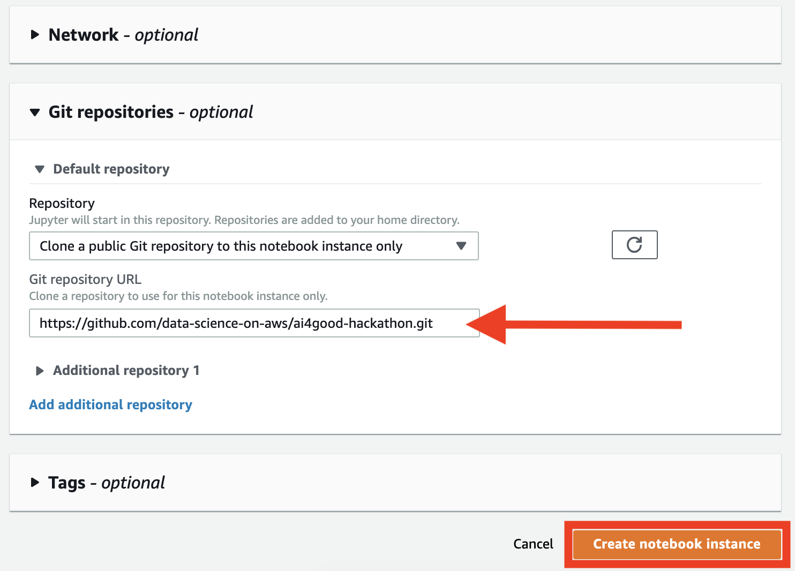

    * You can leave everything else to default, and hit `Create notebook instance`

* Your notebook instance is now being created (this can take 2-3min)

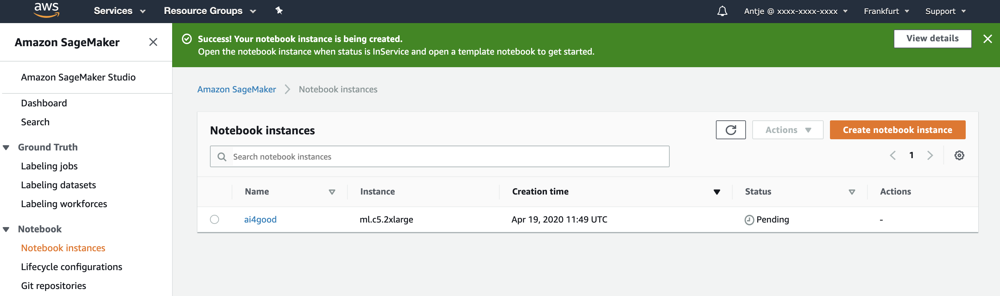

* Once the instance shows Status `InService` you can connect to it via `Open Jupyter` or `Open JupyterLab`. 
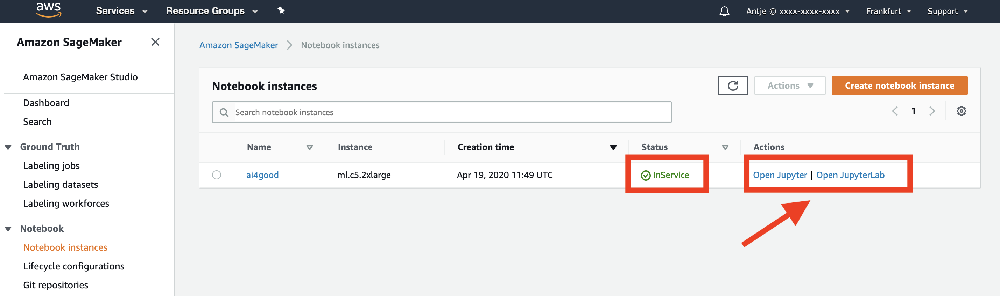

* This opens up your notebook environment with the cloned Git repo ready. 
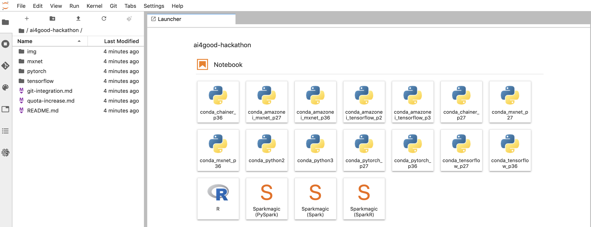

Note: You can also connect a Private GitHub or GitLab repo, just follow [these](git-integration.md) instructions.

### Step 7:  Clone any other GitHub Repo

If you want to clone another Git repo: 

* Open a New Terminal
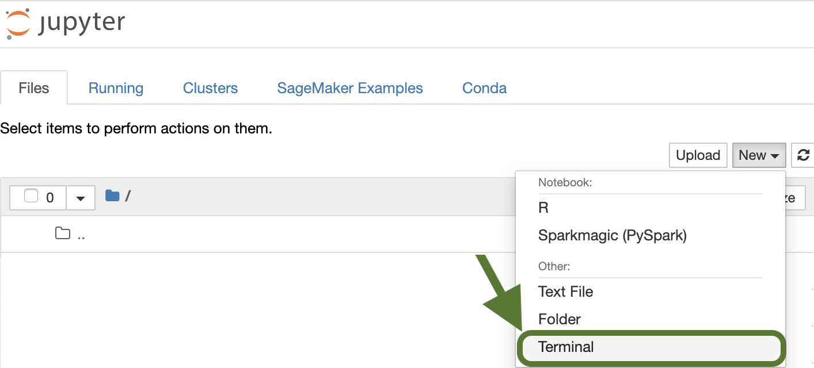()

* Clone the Git repo using the following command (we are using this repo as an example again):

```
cd ~/SageMaker

git clone https://github.com/data-science-on-aws/ai4good-hackathon.git
```

### Step 8:  Train a Model Using Your SageMaker Notebook Instance
* [**Sample TensorFlow Notebook**](tensorflow/) using Distributed TensorFlow and SageMaker.
* [**Sample PyTorch Notebook**](pytorch/) using Distributed PyTorch and SageMaker.
* [**Sample MXNet Notebook**](mxnet/) using Distributed MXNet and SageMaker.
* To adapt a custom training script to SageMaker, please follow [these instructions](https://sagemaker.readthedocs.io/en/stable/using_tf.html#adapting-your-local-tensorflow-script).

### Step 9:  Submit Your Trained Model
* [Competition Code Requirements]()

## More Resources
* [Deep Berlin AI For Good Hackathon 2020](https://deep-berlin.ai/hackathon2020/)
* [Official Hackathon Github Repo with Datasets](https://github.com/deepberlin1/aiforgood2020)
* [More Amazon SageMaker Sample Notebooks](https://github.com/awslabs/amazon-sagemaker-examples/tree/master/sagemaker-python-sdk)